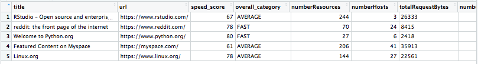

# googlePageSpeedR

This package makes a call to the Google PageSpeed Insights API and returns a data frame of results. 

This means you can programatically retrieve all of the analysis points accessible via the [Google PageSpeed Insights webpage](https://developers.google.com/speed/pagespeed/insights/?url=http%3A%2F%2Fwww.rstudio.com).

Useful for analysing your / your competitors' page performance and organising into glorious tabular format.

### TODO
- Fix type coercion issues within results.

### Install

```{r eval = FALSE}
devtools::install_github("Phippsy/googlePageSpeedR")
```

### Simple Query

We define the URL to analyse and then pass it to the `get_pagespeed()` function.

```{r}
library(googlePageSpeedR)
page <- "https://www.rstudio.com"
insights <- get_pagespeed(ps_url = page)
insights
```


We are given back a data frame containing a number of key metrics for the given page.

Definitions for each metric can be reviewed at [https://developers.google.com/web/tools/chrome-user-experience-report/#metrics](https://developers.google.com/web/tools/chrome-user-experience-report/#metrics)

### Provide an API key

The pagespeed insights API doesn't seem to require an API key, but you can provide one. Get your key from the [Cloud console](https://console.cloud.google.com/) then define it in your query.

```{r, eval=FALSE}
my_key <- "abcdefgHIJK"
insights <- get_pagespeed(ps_url = page, key = my_key)
```

### Multi-page query

Given that we have a convenient function for getting pagespeed insights, it's easy to iterate over many URLs and get a nice, large collection of results.

I favour the `tidyverse` approach and `map()` collection of functions, but you could achieve the results below with for loops or `apply()` functions, as you prefer.

```{r, message=FALSE, warning=FALSE}
library(tidyverse)
urls <- list("http://www.rstudio.com", "http://www.reddit.com", "https://www.python.org/", "https://myspace.com/", "https://www.linux.org")
multi_results <- map_df(urls, get_pagespeed)
multi_results
```



#### Update - preventing data loss using `possibly`

Unfortunately, if any of your URLs return an invalid http status (e.g. `Bad Request (HTTP 400)`) then you will lose all data for all URLs when you call `map_df()`.

A workaround for this is to wrap `get_pagespeed()` in the `possibly()` function from `purrr`. Many thanks to [Johannes Radig](https://twitter.com/joradig/status/979692615531720704) for flagging this issue in [this Twitter convo](https://twitter.com/joradig/status/979692615531720704).

The drawback with the below code is that you won't know if any URLs fail - you'll have to cross-check the data frame of results against the list of URLs you submit.

```{r, message = FALSE, warning = FALSE}
urls <- list("http://www.rstudio.com", "http://www.reddit.com", "https://www.python.org/", 
             "http://www.thisisnotarealURLandisntgoingtowork.com", "https://myspace.com/", "https://www.linux.org")

# The code below would fail - not run
# multi_results <- map_df(urls, get_pagespeed)
# multi_results

# Adding our safe function
safe_pagespeed <- possibly(get_pagespeed, otherwise = NULL)
safe_multi_results <- map_df(urls, safe_pagespeed)
safe_multi_results

```

### Raw content query

If you prefer to have the API response converted directly into a list and select the values of interest, you can do this using `get_pagespeed_content()`. 

```{r}
insights_content <- get_pagespeed_content(ps_url = page)
str(insights_content[1:5])
```

